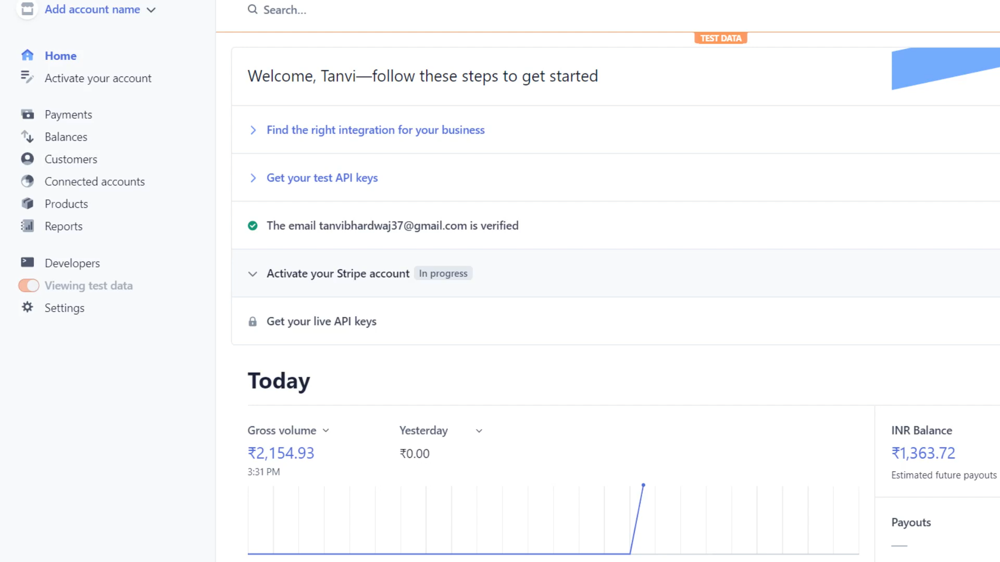
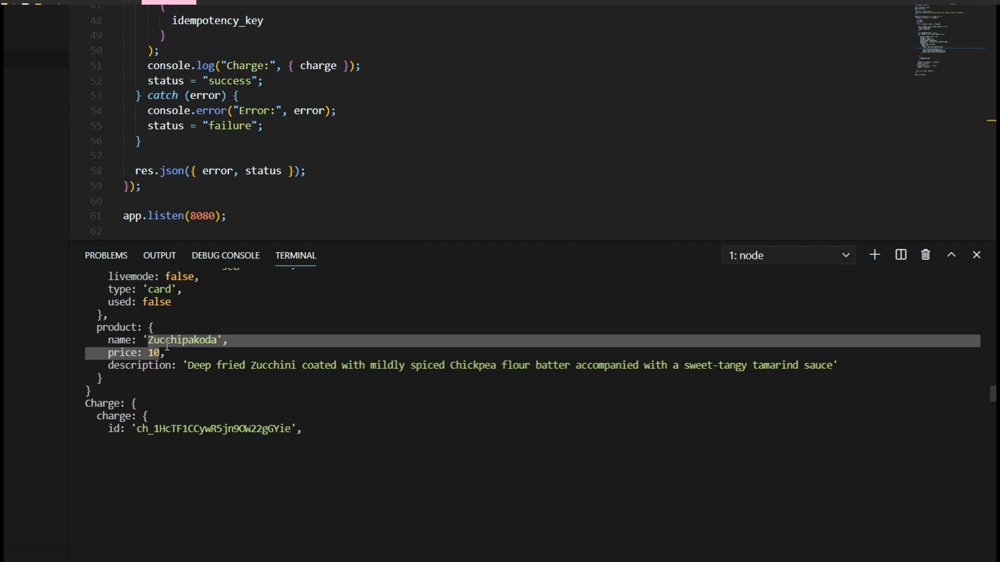

# Simple_Reactapp_Stripe_

The first two folders Public and src are for react app and third index.js file is of node application. 

First link is showing React App interface

[![CLICK]](https://youtu.be/cDqeehCcFrw)

Second Link is showing data passed to backend

Third Link is for Stripe Payment Gateway

